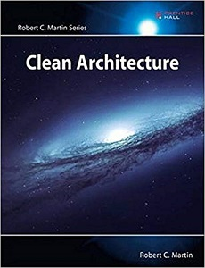
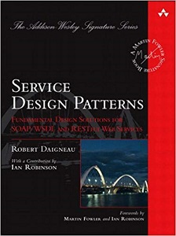
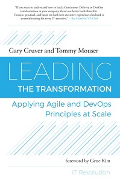

# Développement
* The Pragmatic Programmer: your journey to mastery, 20th Anniversary Edition, 2nd Edition, [David Thomas](https://pragdave.me/), [Andrew Hunt](https://toolshed.com/)
 

* [Adaptive Code - Agile coding with design patterns and SOLID principles (second edition)](https://www.microsoftpressstore.com/store/adaptive-code-agile-coding-with-design-patterns-and-9781509302581), [Gary McLean Hall](https://www.codementor.io/garymcleanhall)
[Github](https://github.com/garymcleanhall)

* [The Design of Web APIs](https://www.manning.com/books/the-design-of-web-apis), [Arnaud Lauret](https://apihandyman.io/)
 

* [Dependency Injection - Principles, Practices, and Patterns](https://www.manning.com/books/dependency-injection-principles-practices-patterns?query=Dependency), [Steven van Deursen](https://blogs.cuttingedge.it/steven/), [Mark Seemann](https://blog.ploeh.dk/)
 

* [Refactoring: Improving the Design of Existing Code, 2e Edition](https://martinfowler.com/books/refactoring.html), [Martin Fowler](https://martinfowler.com/)
 

* Clean Coder, The: A Code of Conduct for Professional Programmers, By Robert C. Martin
 

* Concurrency in C# Cookbook, Stephen Cleary
 

* Building Microservices - Designing fine-grained systems, Sam Newman* Docker in Practice (second edition), Ian Miell, Aidan Hobson Sayers
 

* Applying UML and Patterns - An introduction to object-oriented analysis and design and iterative development, Craig Larman
 

# BDD
* [Behavior-Driven Development with Cucumber: Better Collaboration for Better Software](http://www.informit.com/store/behavior-driven-development-with-cucumber-better-collaboration-9780321772633), [Richard Lawrence](), [Paul Rayner]()

# Architecture
* Clean Architecture: A Craftsman's Guide to Software Structure and Design, By Robert C. Martin
 

* Cloud Native Patterns, Cornelia Davis
 

* Microservices in Action, Morgan Bruce, Paulo A. Pereira
 

* Secure by Design, Dan Bergh Johnsson, Daniel Deogun, Daniel Sawano
 

* UML Distilled: A Brief Guide to the Standard Object Modeling Language, 3rd Edition, [Martin Fowler](https://martinfowler.com/)
 

* Service Design Patterns: Fundamental Design Solutions for SOAP/WSDL and RESTful Web Services, By Robert Daigneau
 

* [Patterns of Enterprise Application Architecture](https://martinfowler.com/books/eaa.html), [Martin Fowler](https://martinfowler.com/)
 

* Securing DevOps, Julien Vehent
 

# Méthodologie et changement
* Clean Agile: Back to Basics, By Robert C. Martin
 

* Agile Project Management with Kanban, By Eric Brechner
 

* Leading the transformation - Applying Agile and DevOps Principles at Scale, Gary Gruver, Tommy Mouser
 

* [EDGE - Value-driven digital transformation](https://www.thoughtworks.com/books/edge), [Jim Highsmith](https://www.thoughtworks.com/profiles/jim-highsmith), [Linka Luu](https://www.thoughtworks.com/profiles/linda-luu), [David Robinson](https://www.thoughtworks.com/profiles/david-robinson)
 

* SAFe 4.5 Reference Guide: Scaled Agile Framework for Lean Enterprises, 2nd Edition, By Dean Leffingwell
 

* The BPMN Graphic Handbook, Esteban Herrera
 

* SCRUM Insights for practitioners - The Scrum Guide Companion, Hiren Doshi
 

* The Passionate Programmer - Creating a remarkable career in software development, Chad Fowler
 

* Antifragile - Things that gain from disorder, Nassim Nicholas Taleb
 

* The DevOps Handbook, Gene Kim, Jez Humble, Patrick Debois, John Willis
 

* The Phoenix Project, Gene Kim, Kevin Behr, George Spafford
 
